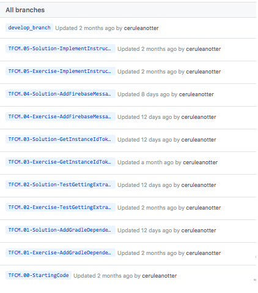
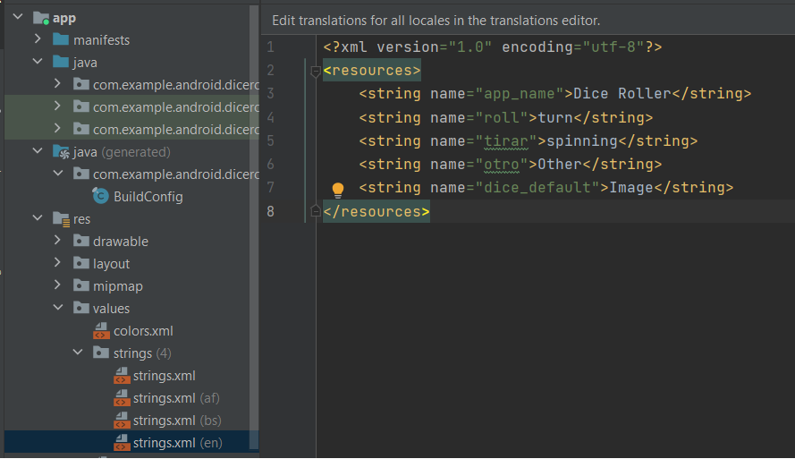
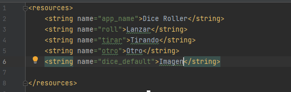
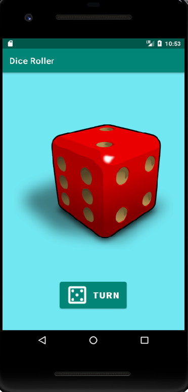
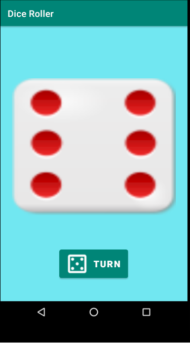
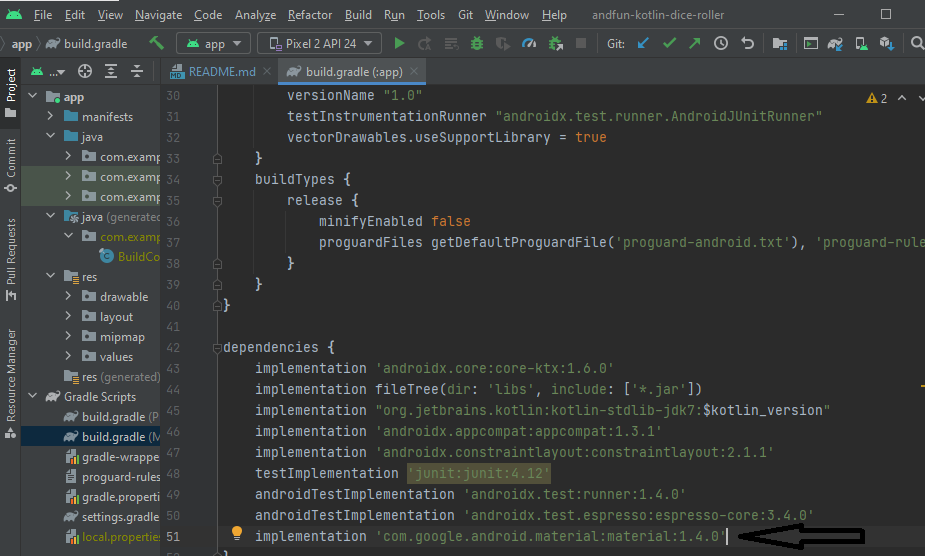
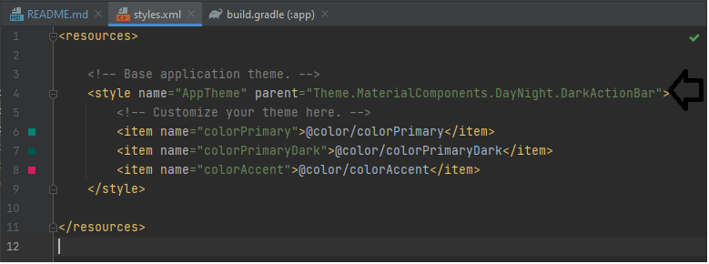
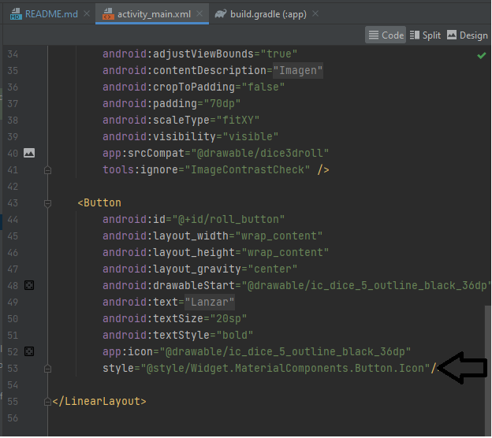

# Ejercicio Dice Roll  

## Objetivos del ejercicio:

1. Realizar todos los pasos de cada rama (revisar los TODO)
2. Utilizar strings.xml según idioma
3. Cambiar strings en el layout
4. Cambiar las imágenes en drawable 
5. Cambiar la función random por algo similar 
6. Cambiar el estilo por defecto de los botones por material design

### Objetivo 1:

Cada **rama** tiene una acción a realizar con TODO y su respectiva solución

Propone una serie de tareas a realizar y en la siguiente rama da la solución

### Objetivo 2:
Creo un strings a partir del existente para añadir el lenguaje inglés a la app 

### Objetivo 3:

Cambio los nombres a los distintos string que contiene el archivo y añado dos string nuevos para poder accerder a ellos en el código de la app

### Objetivo 4:

Sustituyo todas las imágenes que trae la aplicación por otras que han sido descargadas.
Para ello añado dichas imágenes al directorio res/drawable.
En el when de la función rollDice hago llamada a cada una de ellas en función del número random.

    diceImage = findViewById(R.id.dice_image)
    }

    private fun rollDice() {
        // cambio la función random() por shuffled.last()
        // Creada rama solución
        val randomInt = (1..6).shuffled().last()
        val drawableResource = when (randomInt) {
            1 -> R.drawable.one
            2 -> R.drawable.two
            3 -> R.drawable.three
            4 -> R.drawable.four
            5 -> R.drawable.five
            else -> R.drawable.six
        }

        diceImage.setImageResource(drawableResource)
    }

Primero cargo mi imagen por defecto en diceImage = findViewById(R.id.dice_image)

Después en función del número salido en el random() saldrá la imagen correspondiente

### Objetivo 5:

Cambio la función Random() por->

    val randomInt = (1..6).shuffled().last()

### Objetivo 6:

Cambio el estilo del botón por defecto por los proporcionados por Material Design

#### Pasos:

1. Importar librería
- Entrar en la [página oficial de Material Design](https://material.io/components/buttons/android)  
- Pinchar en el link [Getting Started](https://github.com/material-components/material-components-android/blob/master/docs/getting-started.md)
- Abrir el archivo build.gradle en el proyecto de Android Studio
- Comprobar que dentro de sección repositories esta google()
- Añadir la librería en la sección de dependencies de build.gradle del módulo (Última versión [Aquí](https://mvnrepository.com/artifact/com.google.android.material/material))

- Actualizar el tema que trae por defecto en archivo _/res/values/styles.xml_

url del commit [aquí](https://github.com/jsamperevazquez/andfun-kotlin-dice-roller/commit/7411d8e5aca276e477dd44486b7988816e44bc06)

2. Definir estilo del botón
- Dentro de la pagina oficial de Material Design escoger el botón que deseamos y copiar el la etiqueta Button(podremos crear el botón con la interfaz de diseño y copiar solamente el atributo style) con los atributos

3. Crear un icono
- Descargar un icono de la [pagina](https://fonts.google.com/icons?selected=Material+Icons)  
- Insertar el icono dentro de la carpeta _/res/drawable_
- Apuntar al icono en atributo **app:icon** de la etiqueta _Button_ en activity_main.xml

